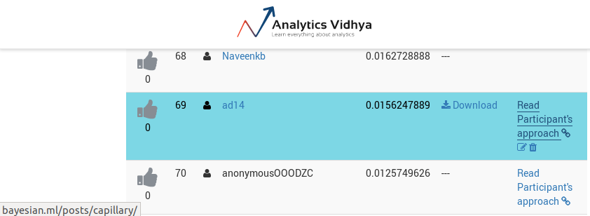
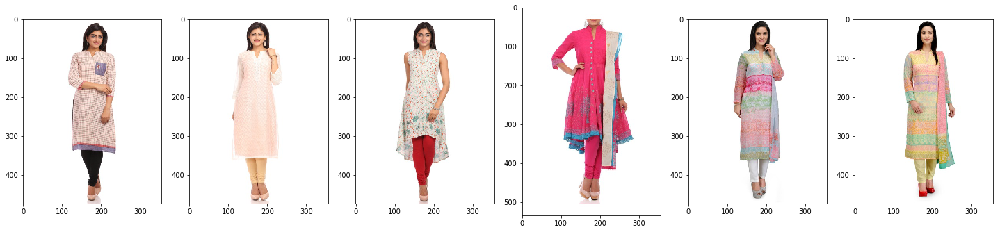
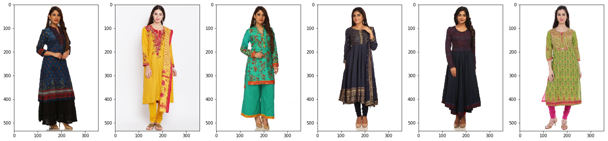

# How to rank 24% at an AnalyticsVidhya competition with 24 lines of code and no statistics or machine learning whatsoever

This blogpost is about my approach at the [AnalyticsVidhya competition of 20/01/2019.](https://datahack.analyticsvidhya.com/contest/capillary-machine-learning-hackathon/)


   

The goal of the competition was to recommend products to users of an online shop.
Since I ended up taking the wrong approach of predicting the next product based on features of the previous, none of statistical my models had predictive power whatsoever, this blogpost is clickbait about my baseline.


# The approach (TL;DR):

I treated the purchases of every user as a timeseries.
Then, for every product, I computed how often another product was bought at the next point in time, [a bit like a bi-gram.](https://en.wikipedia.org/wiki/N-gram) Other people did worse, and I ended up 69/290, or top 24%.


# The data


```python
import pandas as pd
import numpy as np
user_df = pd.read_csv("train- Capillary 4/train.csv")
print(user_df.head())
product_df = pd.read_csv("train- Capillary 4/product_attributes.csv")
print(product_df.head())
```

Listing 1: The product attributes were a waste of time.





Very colourful.One of these rows represents some top-sellers, whereas the other represents items only being bought once. Can you distinguish among them? (EDIT: In hindsight, they do seem very different, [and the people who used visual similarities did quite alright](https://drive.google.com/open?id=1T2dGWdyCy7gCm5bPbKeZzpmBhKOdlLdx) )

# The 24 lines of code:


```python
from collections import Counter
import csv

test_df_writing = pd.read_csv("train- Capillary 4/test_nFNPSyV.csv")
xy = []
last_product_dict = {}

for idx, user in enumerate(user_df.groupby("UserId")):
    product_list = user[1]["productid"].values.tolist()
    for idx in range(len(product_list) - 1):
        xy.append((product_list[idx], product_list[idx + 1]))
    last_product_dict[user[1]['UserId'].values[0]] = product_list[-1]
next_dict = {}
for x, y in xy:
    if x not in next_dict: next_dict[x] = Counter()
    next_dict[x][y] += 1
recommended_top_10 = count_of_products.sort_values(by="count", ascending=False).head(n=10).index.values.tolist()
recommended_top_10
def recommend(userid):
    last_product_id = last_product_dict[userid]
    if last_product_id not in next_dict: return recommended_top_10
    recommended_total = sum([x[1] for x in next_dict[last_product_id].most_common()])
    recommended = [x[0] for x in next_dict[last_product_id].most_common(10) if ((float(x[1])/ recommended_total) >= 0.05)]
    if len(recommended) < 2:
        recommended = [x[0] for x in next_dict[last_product_id].most_common(2)]
    return recommended
```

# Analysis:
Wow, look at that, exactly 24 lines of code!
Where do the numbers 0.05 and 2 most common come from? Not a cross-validation set. Better luck next time!

# For completeness, also the code to write the .csv
(That was given as sample code).


```python
fields=['UserId','product_list']
filename = 'top_10_by_previous.csv'
with open(filename, 'w' ) as f:
    writer = csv.writer(f)
    writer.writerow(fields)
    userids = test_df_writing['UserId'].values.tolist()
    for user in userids:
        products = []
        scores = []
        results = []
        recommended = recommend(user)
        results.append(user)
        results.append(recommended)
        writer.writerow(results)        
```
